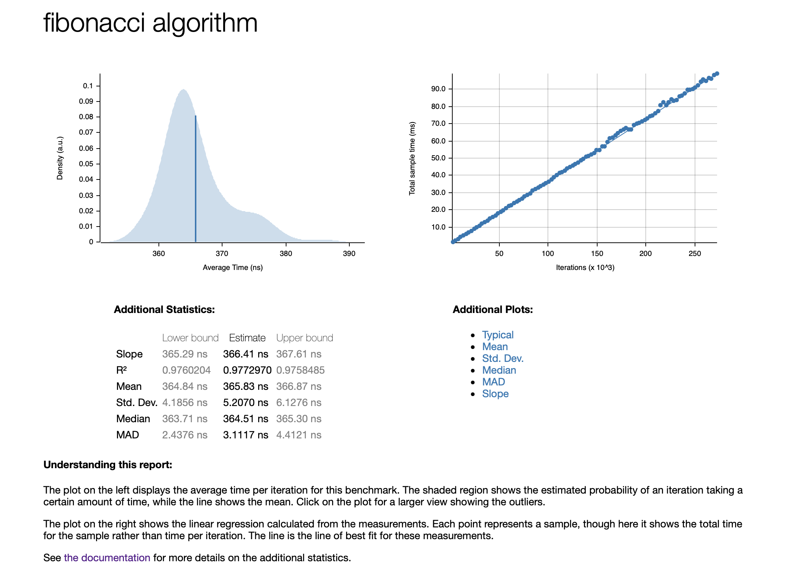

# Weekly Rust Progress Report
Build a useful API server in the domain of data engineering or machine learning engineering.

## Week 1 Progress

This week, I familiarized myself with the basics of Rust and gained hands-on experience by using the Rust Project Template (from https://github.com/nogibjj/rust-new-project-template). My first Rust project was building an API server, which provided a great opportunity for practical application of my newfound knowledge.
```

#[get("/api/health")]
async fn api_health_handler() -> HttpResponse {
    let response_json = &GenericResponse {
        status: "success".to_string(),
        message: "Health Check".to_string(),
    };
    HttpResponse::Ok().json(response_json)
}
```

## Week 2 Progress

This week, I set up a GitHub CICD action pipeline for building, linking, and testing. Additionally, I utilized a Dockerfile to package my Rust services. Furthermore, I deployed the service on Google Cloud Platform using Kubernetes. You can access a demo of the setup at https://apiv2.sszzz.me.

## Week 3 Progress
This week, I set up a rust bench. In order to test the performance of the Rust, I write a single fibonacci sequence. The result is shown below.

```
pub fn fibonacci(n: u32) -> u32 {
    if n <= 1 {
        return n;
    }
    return fibonacci(n - 1) + fibonacci(n - 2);
}
```

### Usage
> Run `make run` in the terminal, it will launch a server.

> Run `curl -v http://localhost:8000/api/health` to get the JSON response.

> Run `make bench` in the terminal, it will run the benchmark test for fibonacci.

## Benchmark Results


## References

* [rust-cli-template](https://github.com/kbknapp/rust-cli-template)
* [server](https://codevoweb.com/build-a-simple-api-with-rust-and-actix-web/)